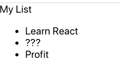

#  ToDo List Deliverable

## Review

So, we've gone through all of the basics of React. To really hammer it home with practice, let's walk through complete creation of an app. This will be a to-do list, keeping track of everything we need to do for the day.

This is what it should look like at the end **without styling**:



## Class-based and function-based components
Remember that both class-based and function-based components are common! For this exercise, we will alternate between them for practice. Eventually you should be familiar with both. 

## Getting Started

**FIRST** fork and clone this repository!

**NEXT** cd into the directory created by your clone command.

Next, use `create-react-app` to create a `to-do-list` project. `cd` into your react app folder and run `npm start` to start a server that will serve your new React application!

* Make sure that as you go, you frequently check the site to ensure your changes are all reflecting accurately!

### `App`, our top-level component

**Function-Based Component**

Notice that `create-react-app` gave you a function-based `App` component to start with. Let's roll with this for the remainder of this component.

Change the contents of your `App` component's return statement to the following:

```js
return (
  <div>
    <header>My List</header>
    <div>
      <ul>
        <li>Test List Item</li>
      </ul>
    </div>
  </div>
)
```

Now, our webpage displays an empty list.

### Our next component
Make a component called `ListItem`. Put it in a new folder called `components` inside the existing `src` folder. This component is going to display the contents of a single todo item. We'll make an instance of this component for each item we want to show in our todo list. For now, this component can simply render  `<li>Make the list!</li>`.

* You can make this component either class-based or function-based.

* Remember to use an `export` statement at the end of the new file to make the code in this file available elsewhere in our application.

* Don't forget to import your `ListItem` component into `App.js`. Then, inside the return statement of `App`, replace the existing `<li>` tag with our `<ListItem />`

<details>
  <summary>Need a hint?</summary>

  ```js
    // in App.js
    function App() {
      return (
        <div>
          <header>My List</header>
          <div>
            <ul>
              <ListItem />
            </ul>
          </div>
        </div>
      )
    }

    // in ListItem.js
    // the function-based version:
    function ListItem() {
      return (
        <li>Make the list!</li>
      )
    }

    // or the class-based version:
    class ListItem extends Component {
      render() {
        return (
          <li>Make the list!</li>
        )
      }
    }
  ```
</details>

At this point, our app looks like this:


### Props to you!

This is a great start - we've already nested components (`ListItem` inside of `App`). Now, let's add some props to make this useful and check that current list item off!

Let's first just pass a prop into `ListItem` from `App`. We'll call the prop something simple, like `doThis`. Make the value different that what you already have so you can make sure your changes are rendering

Then, in `ListItem`, we'll add a list item that uses the `doThis` prop instead of the existing hard-coded text.

Now that we've passed in a prop to `ListItem`, we need to call it in `ListItem.js` using `this.props` (Just `props` for functional components!)

<details>
  <summary>Need a hint?</summary>

  ```js
    // in App.js
    function App() {
      return(
        <div>
          <header>My List</header>
          <div>
            <ul>
              <ListItem doThis={'Learn React'}/>
            </ul>
          </div>
        </div>
      )
    }
  ```
  ```js
    // in ListItem.js
    // function-based
    function ListItem(props) {
      return (
        <li>{props.doThis}</li>
      )
    }

    // class-based
    class ListItem extends Component {
      render() {
        return (
          <li>{this.props.doThis}</li>
        )
      }
    }
  ```
</details>

Your app should look like it was in the previous step with a different to-do item.


### Third, re-use the `ListItem` component
One reason we create components is so that we can repeat them easily!

Add more `ListItem`s to your `App`'s return statement, giving each one a different `doThis` prop.


### Upgrade: render different items in an array.

If we want to make this a truly extensible list, we could create an array of items, pass them into props through the `ListItem` component, and then render each item. Let's do that now.

The easiest way to do this is by using the `map` function. A map is like a `for` loop. With `map`, you make a new variable and iterate through each item in an array with it.

1. In your `App` component, before the return statement, create a variable called `list`.
1. Create a new variable called `listItems` that is the result of `map`ping over `list`. Each element of `listItems` should be a `ListItem` component.
1. Replace our multiple `ListItem` components with the `listItems` variable. Remember that jsx uses curlies to embed variables. 

*Note:* Please get used to mapping in this way, it is very common in react!

<details>
  <summary>Need a hint?</summary>

  ```js
    function App() {
      const list = ['Learn React', '???', 'Profit']
      const todos = list.map((todo, index) => {
        return <ListItem doThis={todo} key={`list-item-${index}`} />
      })
      
      return(
        <div>
          <header>My List</header>
          <div>
            <ul>
              {todos}
            </ul>
          </div>
        </div>
      )
    }
  ```
</details>

Your app should now look like the first image!

*Note:* what's up with the `key` prop? React relies on a property called `key` to keep track of children elements in a list. Whenever you are iterating to make a list of elements, you should include a key prop that's unique to each element, often done by using the index of iteration.

### Bonus

Do some styling! Try separating your overall styles (like background color) and your component specific styles (like the color of your to-do items) in different css files and importing them.
